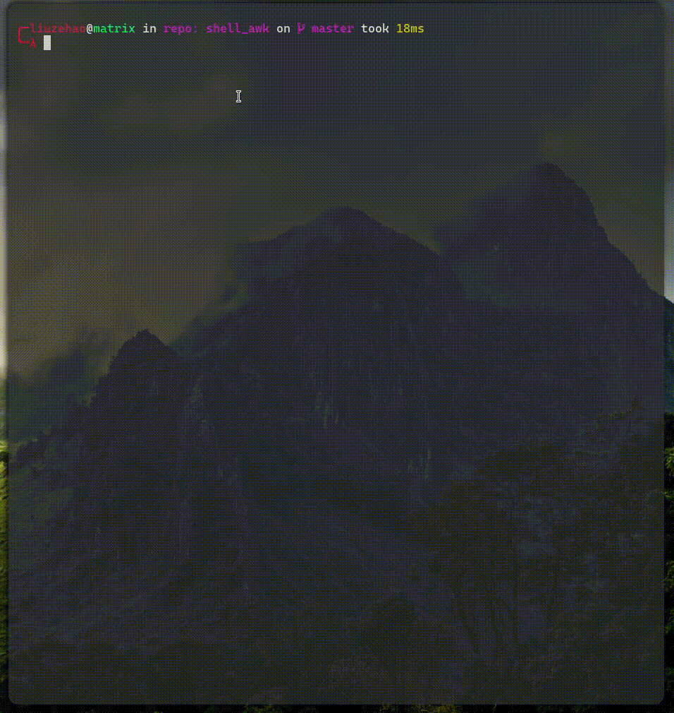

# useless-toy
some daily useless toy wrote in as homework or just boring

# 说明
**没啥好说的，就如同仓库名字， useless-toy, 不定时期写的玩具代码，代码质量也不尽相同**
# 目录
## 万年历(C++实现终端版本)


## awk实现黑客帝国代码雨




## Linux默认中文目录转换程序

```shell

#!/bin/bash
# Author: LazyHippo
# Date: 2023-03-09 17:28:28 CST
# function: Change the Directories name from Chinese to English

mv 桌面 Desktop
mv 下载 Download
mv 模板 Templates
mv 公共的 Publicshare
mv 文档 Documents
mv 音乐 Music
mv 图片 Pictures
mv 视频 Videos

awk 'BEGIN{ OFS=""  }{if ($0 ~ /#/) next;split($0, a, /_/);print("XDG_",a[2],"_DIR=\"$HOME/",lower(a[2]),"\"");} function lower(tk) {res=substr(tk, 1, 1); res=res tolower(substr(tk, 2)); return res;}' $HOME/.config/user-dirs.dirs > $HOME/.config/user-dirs.dir

# if use the origional file, file will be empty
# so just create a new file, and remove the older one and rename
# newer one to origional file name.
rm -f $HOME/.config/user-dirs.dirs
mv $HOME/.config/user-dirs.dir $HOME/.config/user-dirs.dirs
```
